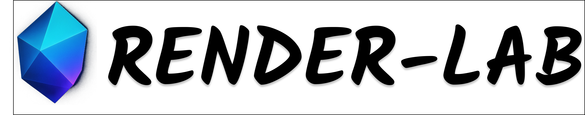

# RenderLab – GLSL & React Three Fiber Shader Gallery
  
**Live Demo:** [https://kojilab.vercel.app/](https://kojilab.vercel.app/)

## Overview
**RenderLab** is a premium gallery of shaders and interactive visuals built with **GLSL**, **WebGL**, and **React Three Fiber**. It showcases creative coding experiments like water shaders, raymarching effects, and procedural visuals – all running live in the browser. This is a **demo-only project**, made for exploring shaders online (not for local setup).

## Features
- 🎨 **Curated Shader Demos:** Live GLSL & R3F experiments  
- 🖱 **Smooth Scrolling:** Lenis-powered transitions  
- 🌑 **Dark Premium UI:** Minimal, responsive, gradient-accented design  
- 🔍 **SEO Metadata:** Each project has custom meta for discoverability  
- ⚡ **Fast Navigation:** Quick GitHub preview & back-to-gallery buttons  
- 🚀 **High Performance:** Real-time rendering optimized for web  

## Tech Stack
- **Framework:** Next.js 14 (App Router)  
- **Rendering:** React Three Fiber + WebGL + GLSL  
- **Scroll Engine:** Lenis  
- **Styling:** Tailwind CSS, custom fonts  
- **Animations:** GSAP / Framer Motion  
- **Deployment:** Vercel  

## Notes
- Repository is **for demo & learning only**  
- Not intended for reuse in production projects  
- Full live experience: [KojiLab Demo](https://kojilab.vercel.app/)  

## Author
**Sujit Kumar** – Fullstack WebGL & React Developer  
- [GitHub](https://github.com/sujitkoji)  

## License
This repository is for **showcase purposes only**. Commercial or production usage is not allowed.
